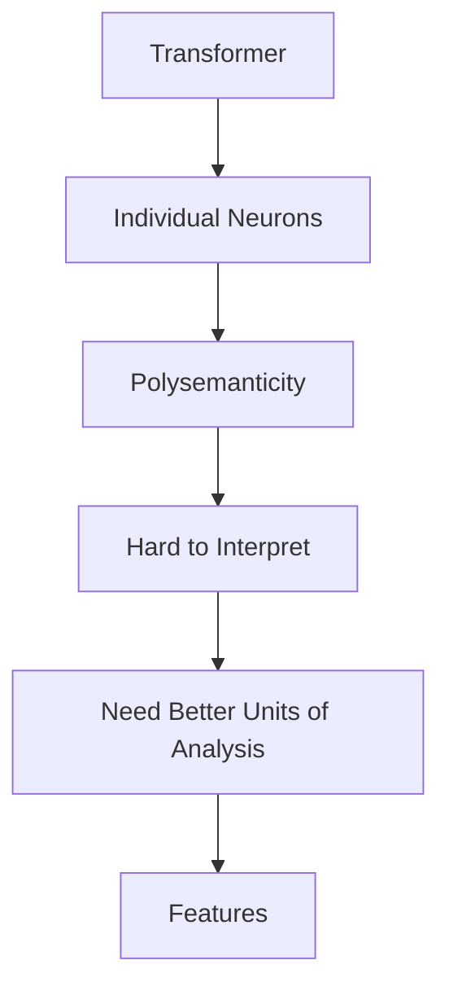
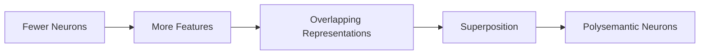
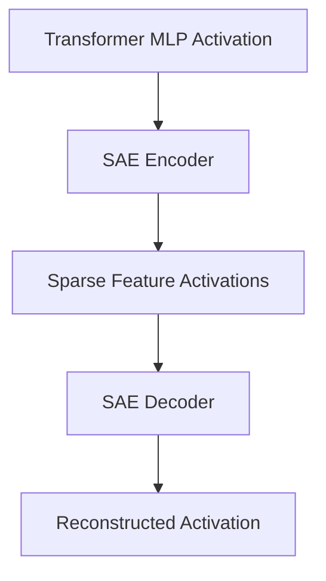
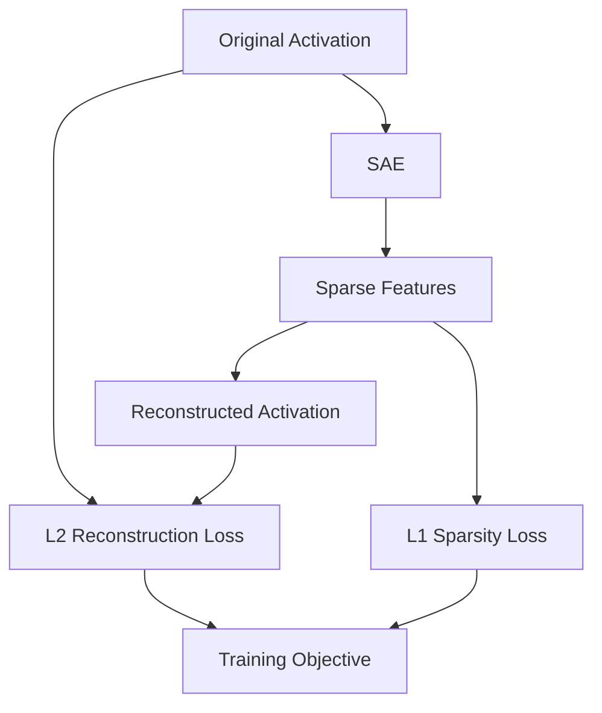
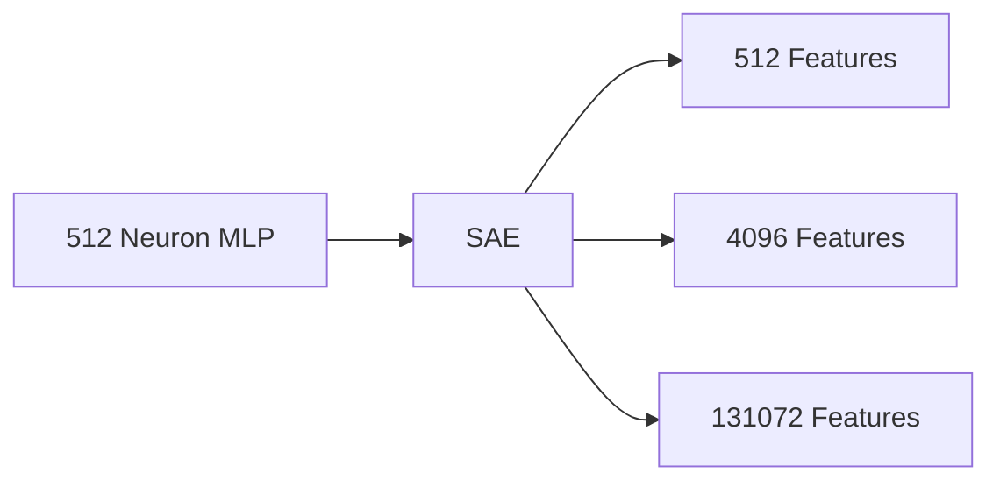
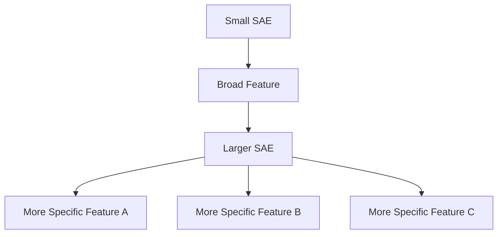
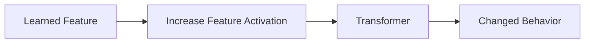
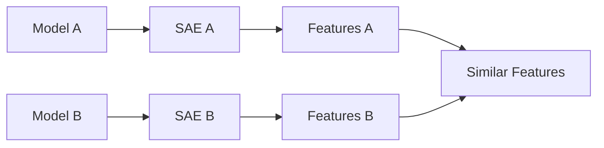
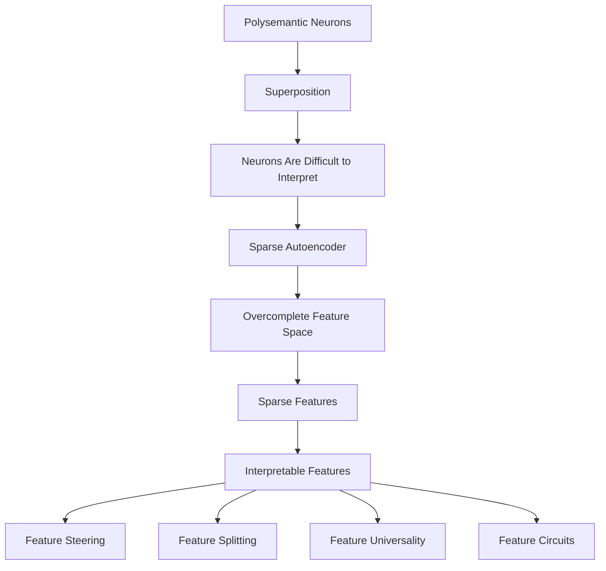

# Towards Monosemanticity: Decomposing Language Models With Dictionary Learning

## Citation

Bricken et al. (2023). *Towards Monosemanticity: Decomposing Language Models With Dictionary Learning*. Anthropic.

---

## Main Idea

The paper investigates whether individual neurons are actually the best units for understanding language models.

The authors show that there can be better units called **features**.

They use Sparse Autoencoders to break transformer activations into a larger number of sparse features.

These features can be easier to understand and more monosemantic than individual neurons.

---

## Problem Setup

Individual neurons can be **polysemantic**, which means that one neuron can respond to multiple unrelated concepts.

The paper connects this to **superposition**.

Superposition happens when a model represents more features than it has neurons by storing multiple features in overlapping directions.

Because of this, looking at one neuron does not always tell us what the model is representing.

The authors therefore try to find the underlying features using dictionary learning.

---

## Features as a Decomposition

A feature is a pattern or concept represented inside the model.

The paper represents an activation as a combination of different learned features.

```text
Activation
    |
    v
Feature 1 × coefficient
+
Feature 2 × coefficient
+
Feature 3 × coefficient
+
...
```
---

## Overcomplete Representation

The SAE uses more features than the original number of neurons.

The transformer studied in the paper has a 512-neuron MLP layer.

The SAEs were trained with expansion factors from 1× to 256×.

This means the largest SAE had 131,072 features.

The reason for using more features is to give the SAE enough space to represent features that may have been stored together because of superposition.

---

## Sparse Autoencoder Setup

The SAE takes the transformer's MLP activation as its input.

```text
Transformer MLP Activation
        |
        v
     Encoder
        |
        v
Sparse Feature Activations
        |
        v
     Decoder
        |
        v
Reconstructed Activation
```
---

## Reconstruction

The SAE tries to reconstruct the original MLP activation.

```text
Original Activation
        |
        v
       SAE
        |
        v
Reconstructed Activation
```
---

## Sparsity

The SAE tries to make only a small number of features active for each input.

The paper uses an **L1 penalty** to encourage this.

There is a tradeoff:

- If there is not enough sparsity, too many features can become active.
- If there is too much sparsity, the SAE may not reconstruct the original activation well.

The goal is to find a balance between reconstruction and sparsity.

---

## Why Not Use Architectural Approaches?

The authors also looked at making the transformer itself sparse.

However, making the original neurons sparse did not solve the problem of polysemanticity.

Because of this, the authors kept the transformer unchanged and used an SAE to decompose its activations.

```text
Original Transformer
        |
        v
   MLP Activations
        |
        v
       SAE
        |
        v
 Learned Features
```
---

## Transformer and Dataset

The model studied in the paper was a small one-layer transformer containing:

- 1 Attention Block
- 1 MLP Block
- 512-neuron MLP
- ReLU activation

The transformer was trained on **The Pile**.

The authors trained the SAEs using approximately 8 billion MLP activation samples.

---

## Individual Features

The authors looked at individual features learned by the SAE.

Some features were related to:

- Arabic script
- DNA
- Base64
- Hebrew

These features were easier to understand than many individual neurons.

Some features were also difficult or impossible to identify clearly by looking at the original neurons.

---

## Feature Density

Feature density tells us how often a feature activates across the dataset.

A feature that activates frequently has high density.

A feature that activates rarely has low density.

The authors studied feature density to understand how often the learned features were being used.

They also found some extremely low-density features that may be artifacts of the SAE training process.

---

## Dead Features

Some SAE features become inactive or rarely activate during training.

These are called **dead features**.

The authors use neuron resampling to replace some dead features with new candidates during training.

---

## L0 Sparsity

L0 tells us how many features are active for a particular input.

For example:

```text
131,072 possible features
        |
        v
8 active features
        |
        v
L0 = 8
```
---

## Reconstructed Transformer NLL

The authors also check whether the SAE reconstruction preserves the behaviour of the original transformer.

They replace the original MLP activations with the reconstructed activations from the SAE.

They then measure the transformer's loss.

This checks whether the SAE is preserving the behavior of the transformer and not just reconstructing the activation numerically.

---

## Feature Steering

The authors change the activation of individual learned features to see whether this changes the transformer's behaviour.

For example, increasing the activation of some language-related features can influence the generated text.

This provides evidence that some learned features are related to the model's behaviour.

---

## Feature Splitting

The authors found that some features can split into more specific features when the SAE has more features available.

For example:

```text
Smaller SAE
    |
    v
Broad Feature
    |
    v
Larger SAE
    |
    +---- Feature A
    |
    +---- Feature B
    |
    +---- Feature C
```
---

## Feature Universality

The authors also studied whether similar features appear in separately trained models.

They found that some similar features can appear across different models.

This suggests that some learned features may represent common patterns rather than being completely specific to one model.

---

## Feature Motifs

The authors found that features do not always work independently.

Some features can be related to each other and activate in patterns.

These groups of related features can help us understand how different features work together inside the model.

---

## Finite State Automata

The authors found examples where multiple features interact in ways that resemble a finite state automaton.

This shows that features can be useful for studying not only individual concepts but also how multiple features work together to produce model behaviour.

---

## Global Analysis

The authors did not only study a few individual features.

They also looked at the features as a whole to understand:

- How interpretable the typical feature is.
- How much of the model can be explained by the learned features.
- Whether the features tell us something about the model or mainly about the data.

This helps check whether the results are more general instead of being based only on a few interesting examples.

---

## Key Findings

The paper provides evidence that individual neurons are not always the best units for understanding language models.

The SAE can find features that are more interpretable and more monosemantic than individual neurons.

The learned features can also be used to study how different parts of the model work together.

The authors found that some features can be used to influence model behaviour.

They also found that increasing the number of features can cause broad features to split into more specific features.

Similar features can appear across separately trained models.

---

## Limitations

The main experiment was done on a small one-layer transformer.

It is not clear whether the same results will work in the same way for much larger language models.

It is also difficult to measure how interpretable a feature really is.

Some features can be very rare or inactive, which can make them difficult to study.

Finding interpretable features is only one step towards fully understanding how a neural network works.

---

## My Understanding

The main thing I understood from this paper is that individual neurons may not be the best way to understand what is happening inside a neural network.

A neuron can contain multiple features because of superposition.

The SAE gives us a larger feature space and tries to represent each activation using only a small number of these features.

The reconstruction makes sure that the SAE does not simply throw away the information in the original activation.

The sparsity makes the representation easier to study because only a small number of features are active at a time.

The paper shows that some of these learned features correspond to understandable concepts and can even affect the model's behavior when activated.

---

# Diagrams

## 1. Problem Setup


## 2. Superposition


## 3. SAE Decomposition


## 4. Reconstruction and Sparsity


## 5. Overcomplete Representation


## 6. Feature Splitting


## 7. Feature Steering


## 8. Feature Universality


## 9. Overall Paper




